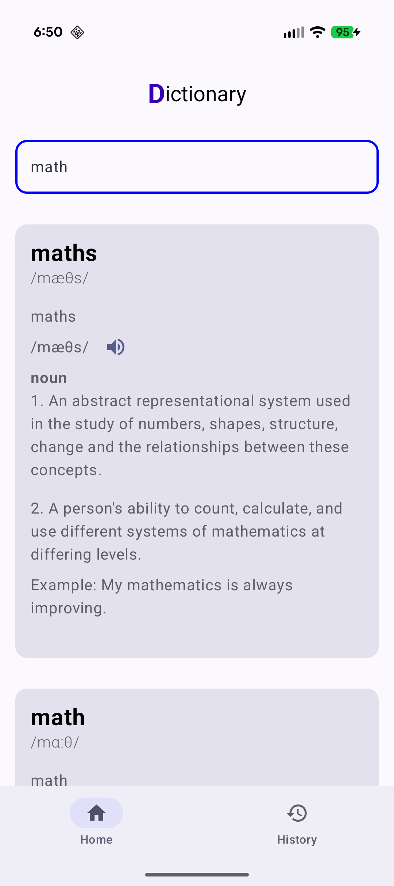
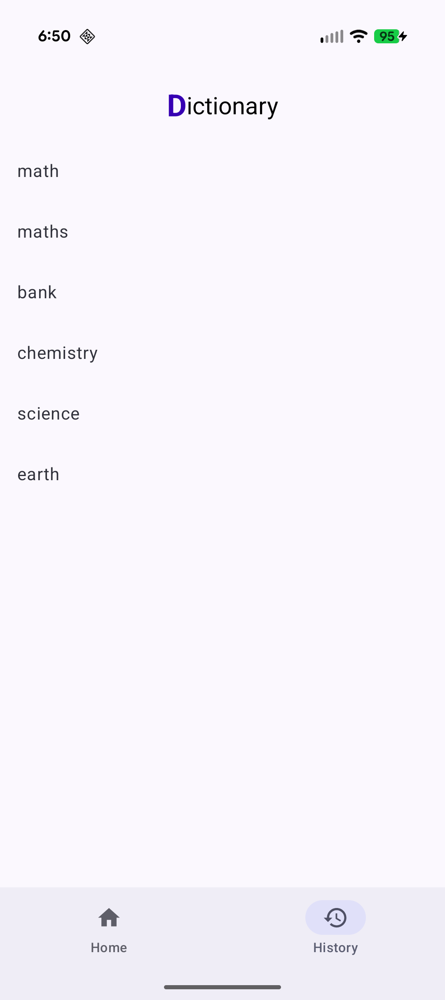

# Dictionary App

Android dictionary app built with Kotlin and Jetpack Compose.

## Features
- Search English words
- Audio pronunciation using ExoPlayer
- Search history
- Clicking a word in search history automatically re-runs the search
- Offline cache using Room

## Tech Stack
- Kotlin
- Jetpack Compose
- ExoPlayer (Jetpack Media3)
- MVVM+clean arch
- Coroutines + Flow
- Hilt
- Retrofit
- Room

## Screens
- Home
- History

## Notes
- Uses dictionaryapi.dev
- Designed for interview and learning purposes

## Screenshots

&nbsp;&nbsp;

